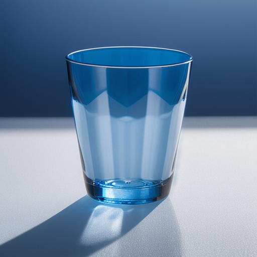
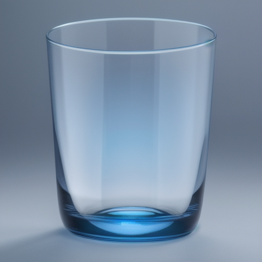
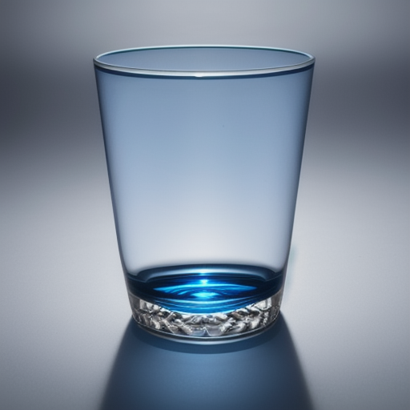
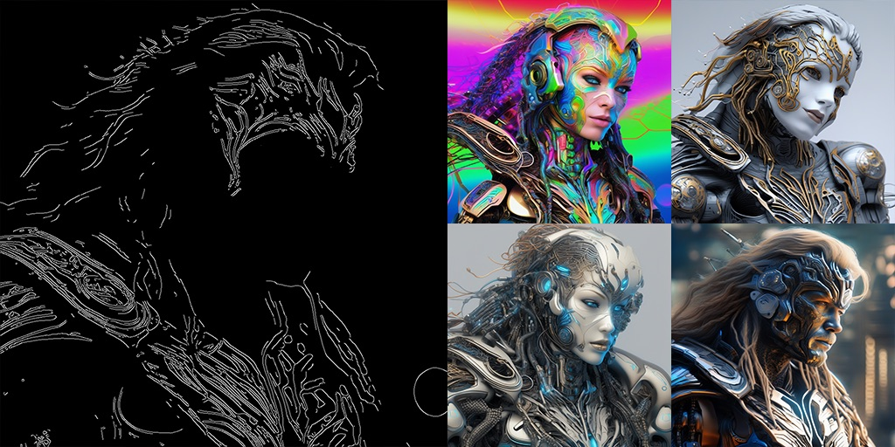

# Progetto Tesi — Generazione di Bicchieri con ControlLoRA-v3

Sistema web per la generazione assistita da AI di immagini fotorealistiche 2D di bicchieri personalizzati, sviluppato come progetto di tesi di laurea triennale in Ingegneria Informatica presso l'Università degli Studi di Firenze.

Il progetto combina **Stable Diffusion**, **ControlNet** e **LoRA** (tramite l'architettura ControlLoRA-v3) per generare immagini di bicchieri a partire da un prompt testuale e da un'immagine di condizionamento strutturale (edge map ottenuta con algoritmo **Canny**), garantendo che forma e proporzioni dell'oggetto vengano rispettate mentre materiali, colori e dettagli sono guidati dal testo.

> Tesi correlata (frontend): [Design Maker Online](https://github.com/LytTheBit/Design_maker_online)

---

## Indice

- [Panoramica](#panoramica)
- [Come funziona](#come-funziona)
- [Struttura del repository](#struttura-del-repository)
- [Requisiti](#requisiti)
- [Installazione](#installazione)
- [Utilizzo](#utilizzo)
- [Dataset](#dataset)
- [Modelli supportati](#modelli-supportati)
- [Risultati](#risultati)
- [Sviluppi futuri](#sviluppi-futuri)
- [Crediti](#crediti)
- [Licenza](#licenza)

---

## Panoramica

Il sistema consente di generare immagini di bicchieri realistici partendo da:
1. Un **prompt testuale** che descrive l'oggetto desiderato (es. *"bicchiere trasparente su sfondo bianco"*)
2. Un'**immagine di condizionamento Canny**, che guida il modello sulla struttura e la sagoma da rispettare

L'addestramento è stato eseguito su GPU cloud (Lambda Labs A100), mentre inferenza e integrazione con il sito web sono state validate in locale su NVIDIA RTX 5070.

## Come funziona

Il progetto si basa su una pipeline custom composta da tre livelli:

1. **Fine-tuning LoRA** — a un modello Stable Diffusion pre-addestrato vengono applicati pesi LoRA leggeri, addestrati su un dataset di immagini di bicchieri accoppiate a mappe Canny e caption descrittivi
2. **Condizionamento ControlNet** — la mappa Canny vincola la generazione a rispettare la sagoma dell'oggetto originale
3. **Generazione** — a partire da rumore casuale, il modello raffina progressivamente l'immagine combinando prompt testuale e condizionamento visivo, fino a produrre il risultato finale

Sono stati sperimentati diversi metodi di condizionamento e modelli di base; il modello **Realistic Vision 4.0** in combinazione con **ControlLoRA-v3** si è rivelato quello con i risultati più fotorealistici.

## Struttura del repository

```
├── model.py                    # Estensione UNet2DConditionModelEx per canali di condizionamento extra
├── pipeline.py                 # Pipeline StableDiffusionControlLoraV3Pipeline (SD 1.5)
├── pipeline_sdxl.py             # Variante della pipeline per modelli SDXL
├── train.py                    # Script di training/fine-tuning per SD 1.5
├── train_sdxl.py                # Script di training per SDXL
├── server.py                   # Server per l'integrazione con il sito web
├── scraping_bicchieri.py        # Script di web scraping per la raccolta del dataset
├── scraping_bicchieri_sito.py   # Variante dello scraper per una fonte specifica
├── exps/                       # Dataset loader custom (sd1_5_tile_pair_data.py, classe TrainDataset)
├── glasses_data/                # Dataset di immagini, canny e caption
├── Scraping_bicchieri/          # Dati grezzi raccolti tramite scraping
├── modelli/                     # Modelli e checkpoint
├── lora_dir/lora/               # Pesi LoRA addestrati (.safetensors)
├── Risultati/                   # Immagini generate durante le varie fasi di sperimentazione
├── imgs/                        # Immagini di supporto
├── tools/                       # Script di utilità
├── requirements.txt             # Dipendenze Python
└── PullGithub.ipynb              # Notebook di supporto
```

## Requisiti

- Python 3.10+
- GPU con supporto CUDA (consigliata per training e inferenza)
- Docker (opzionale, per l'esecuzione containerizzata)

Le dipendenze principali sono gestite tramite [Diffusers](https://huggingface.co/docs/diffusers) di Hugging Face. L'elenco completo è disponibile in [`requirements.txt`](./requirements.txt).

## Installazione

```bash
git clone https://github.com/LytTheBit/progetto-tesi-control-lora-v3-main.git
cd progetto-tesi-control-lora-v3-main
pip install -r requirements.txt
```

## Utilizzo

**Training / fine-tuning** (modelli SD 1.5):
```bash
python train.py
```

Per SDXL:
```bash
python train_sdxl.py
```

**Generazione** tramite pipeline:
```python
from pipeline import StableDiffusionControlLoraV3Pipeline

pipe = StableDiffusionControlLoraV3Pipeline.from_pretrained(...)
image = pipe(
    prompt="transparent blue drinking glass with curved silhouette, isolated on white background, no shadows",
    negative_prompt="deformed, distorted, sketch, blurry, cartoon, colored background",
    canny_image=canny_input,
)
```

**Server**: per avviare l'integrazione con il frontend web (repository [Design Maker Online](https://github.com/LytTheBit/Design_maker_online)):
```bash
python server.py
```

## Dataset

Il dataset è stato costruito tramite **web scraping** da siti e-commerce di articoli in vetro, seguito da un lavoro di pulizia manuale per rimuovere immagini generate da AI (evitando fenomeni di *model collapse*), sfondi non uniformi e dati non idonei.

Ogni immagine del dataset finale è associata a:
- una **mappa Canny** (edge detection dei contorni)
- una o più **caption** descrittive in inglese

Evoluzione del dataset nel corso del progetto:
| Fase | Immagini | Caption | Note |
|---|---|---|---|
| Iniziale | ~100 | 1 per immagine, in italiano | Risultati con artefatti visivi |
| Caption migliorati | ~100 | 5 per immagine, in inglese | Risultati più puliti |
| Dataset ampliato | ~200 | ~1000 | Introdotti i negative prompt |

## Modelli supportati

Sono stati sperimentati tre modelli di base per il fine-tuning:

| Modello | Note |
|---|---|
| Stable Diffusion 1.5 | Veloce e leggero, risultati meno convincenti |
| Stable Diffusion 2.1 base | Qualità superiore, meno stabile nei dettagli fini |
| **Realistic Vision 4.0** | Modello finale scelto — miglior fotorealismo |

## Risultati

Il sistema è in grado di generare immagini fotorealistiche di bicchieri che rispettano la sagoma imposta dalla mappa Canny, con sfondo bianco coerente e materiali/colori definiti dal prompt testuale. I risultati completi, comprensivi del confronto tra le diverse fasi di sperimentazione, sono documentati nella tesi e nella cartella [`Risultati/`](./Risultati).

<p align="center">
  
  
  
</p>
<p align="center">
  
  
</p>

**Confronto mappa Canny → varianti generate:**

<p align="center">
  
</p>

*A sinistra la mappa Canny usata come condizionamento strutturale; a destra alcune varianti generate dal modello a partire dalla stessa sagoma.*

## Sviluppi futuri

- Addestramento personalizzato direttamente integrato nel sito web
- Database relazionale per la gestione di immagini generate e metadati
- Supporto a metodi di condizionamento alternativi (depth map, scribble, pose estimation)
- Migrazione da ControlLoRA a ControlNet per maggiore stabilità e supporto a condizionamenti multipli

## Crediti

Il progetto utilizza come base il lavoro di **HighCWu**: [control-lora-v3](https://github.com/HighCWu/control-lora-v3).

Sviluppato da **Francesco Bonaiuti** come progetto per il corso di Progettazione e Produzione Multimediale (PPM) e come tesi di laurea triennale in Ingegneria Informatica — Università degli Studi di Firenze. Relatore: Prof. Marco Bertini.

## Licenza

Distribuito con licenza MIT. Vedi il file [`LICENSE`](./LICENSE) per maggiori dettagli.
